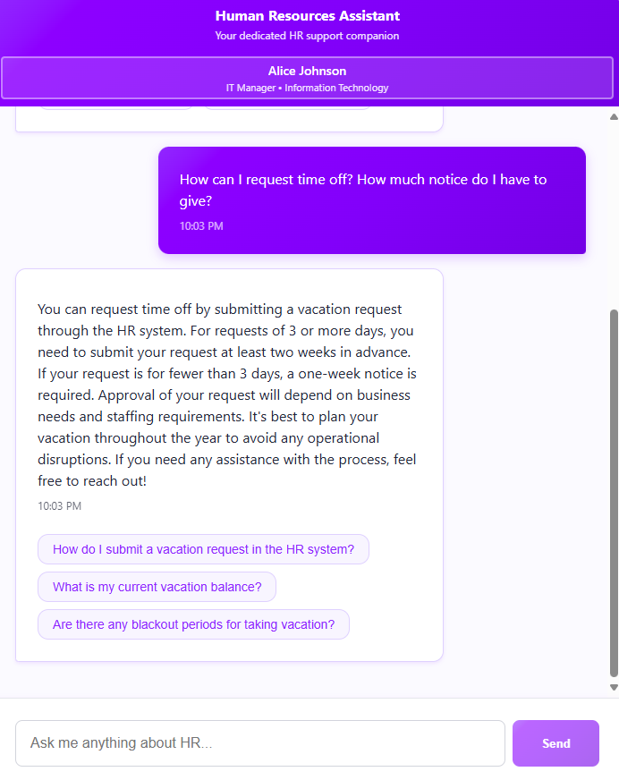

# HR Assistant: Sample Application for Advanced AI Agents in RavenDB

This sample application demonstrates the power of RavenDB's AI Agents Creator feature, showcasing how to build intelligent, secure, and controllable AI agents with minimal code. It serves as a practical example of integrating AI capabilities into a real-world HR system, highlighting the ease of development and the robust guardrails provided by RavenDB.

## Overview

The HR Assistant is a web application that provides an AI-powered chat interface for employees to interact with HR-related information. It leverages RavenDB's AI Agents to handle complex queries about employee data, vacation balances, payroll, workplace policies, and more—all while maintaining strict control over data access and business logic.

For context, this application uses about 300 lines of C# backend code and roughly 700 lines of TypeScript in the frontend. In other words, in about 1,000 lines of code, you have a truly sophisticated agent.



## Key Features of the Application

Even though this is merely a sample app that uses generated data, it showcases an impressive array of capabilities.

- **Intelligent Chat Interface**: Natural language processing for HR queries, allowing employees to ask questions in plain English.
- **Vacation and Time-Off Management**: Query remaining vacation days, schedule information, and request approvals.
- **Payroll Information**: Access to earnings, deductions, and tax information.
- **Issue Reporting and Tracking**: Raise workplace issues and check their status.
- **Document Signing**: Automated onboarding and digital filing processes.
- **Policy Access**: Query workplace policies and procedures.
- **Employee Directory**: Find department contacts and organizational information.

## Benefits of Building AI Agents with RavenDB

Building a comparable AI agent without RavenDB's AI Agents Creator would require weeks to months of development and would be significantly more complex:

- **Memory Management**: Manually implementing conversation memory, summarization, and state tracking to avoid escalating token costs.
- **Data Integration**: Creating secure, controlled access to database data without RavenDB's built-in query integration.
- **Action Handling**: Developing custom infrastructure for the model to request and execute actions safely.
- **Vector Search**: Setting up and managing embeddings, semantic search, and history queries using external tools.
- **Security and Control**: Implementing guardrails to prevent the AI from bypassing business logic or accessing unauthorized data.
- **State Management**: Tracking conversation state, pending actions, and multi-turn interactions without a structured framework.

RavenDB abstracts these complexities, allowing developers to focus on business logic while ensuring security and performance.

## Design Principles

RavenDB's AI Agents Creator empowers developers to build smart agents without getting bogged down in details, while maintaining strict control over application behavior through guardrails that ensure AI operates within defined boundaries.

### All the Code You Didn't Have to Write

RavenDB handles memory management, query integration, actions, structured approaches, vector search, state management, and defined scopes—allowing you to focus on building smarter systems quickly. That is a lot of code that you don't have to write.

## Summary

RavenDB's AI Agents Creator enables building intelligent applications in hours, not months, with minimal code and maximum control.

## Technical Details

### Prerequisites

- RavenDB 7.1 or later
- .NET 9.0 SDK
- Node.js 18+ and npm
- A RavenDB database named "HRAssistant" running on localhost:8080
- **AI Connection String**: In the RavenDB database, define an AI connection string named `Human Resources' AI Model` to connect to the model. Follow the instructions [here](https://docs.ravendb.net/7.1/ai-integration/connection-strings/connection-strings-overview/).

### Quick Start

1. **Clone the repository**
2. **Start RavenDB** and ensure a database named "HRAssistant" exists
3. **Seed the database**:
   ```bash
   curl -X POST "http://localhost:5258/api/seed/all"
   ```
4. **Start the backend**:
   ```bash
   dotnet run --project backend/HRAssistant/HRAssistant.csproj
   ```
5. **Start the frontend**:
   ```bash
   cd frontend/hr-assistant
   npm install
   npm start
   ```
6. **Open the application** at http://localhost:3000

### Architecture

- **Frontend**: React with TypeScript
- **Backend**: C# ASP.NET Core Web API
- **Database**: RavenDB with AI Agents integration
- **Theme**: Modern purple-themed UI

### Available Tasks

- `Start Full Application`: Runs both backend and frontend
- `Start Backend`: Runs the C# API
- `Start Frontend`: Runs the React dev server
- `Seed Database`: Populates RavenDB with sample data
- `Build Backend`: Compiles the C# project
- `Build Frontend`: Builds the React production bundle
